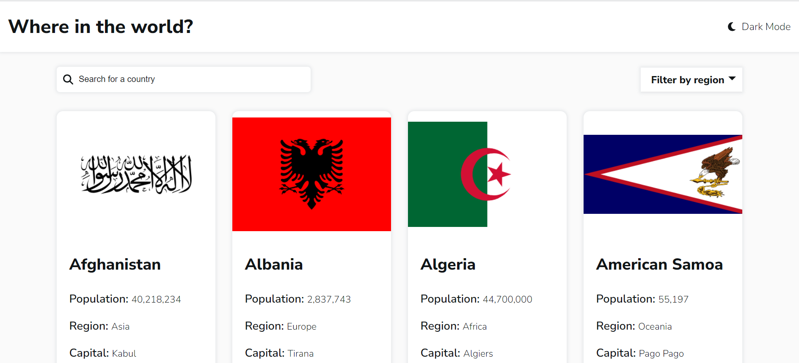
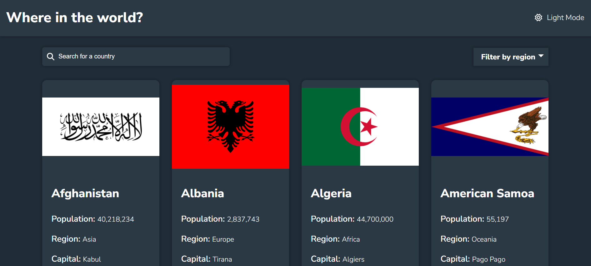
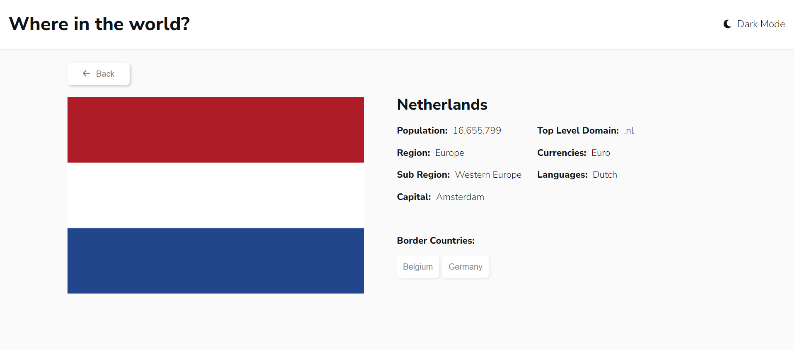
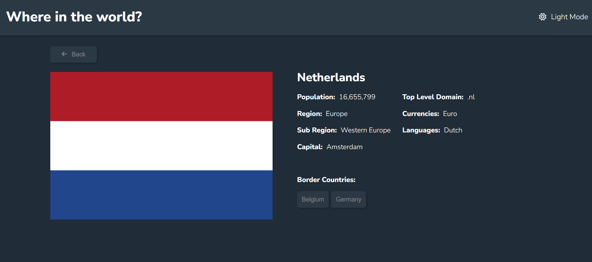
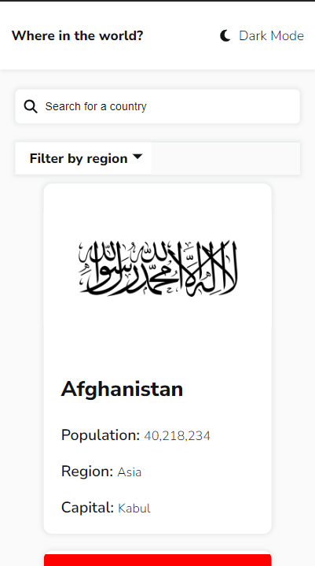
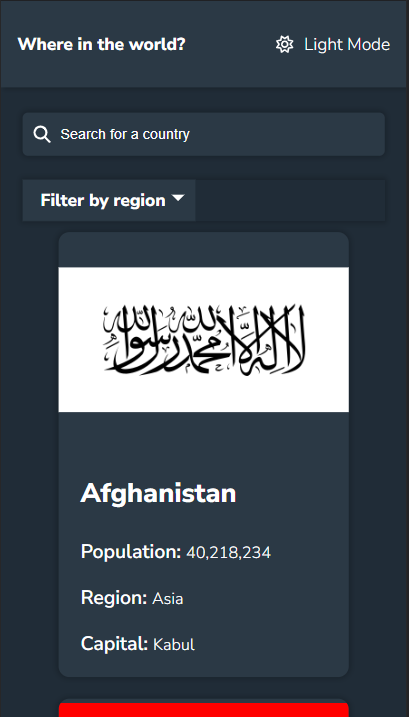
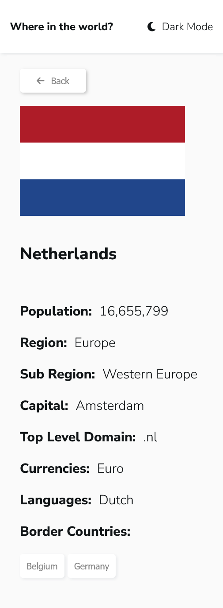

# Frontend Mentor - REST Countries API with color theme switcher

## The challenge

Your challenge is to integrate with the [REST Countries V2 API](https://restcountries.com/#api-endpoints-v2) to pull country data and display it like in the designs.

Your users should be able to:

- See all countries from the API on the homepage
- Search for a country using an `input` field
- Filter countries by region
- Click on a country to see more detailed information on a separate page
- Click through to the border countries on the detail page
- Toggle the color scheme between light and dark mode _(optional)_

Extra:
Light and dark mode is saved in the local storage.

### Screenshots Desktop

### Screenshots Mobile

